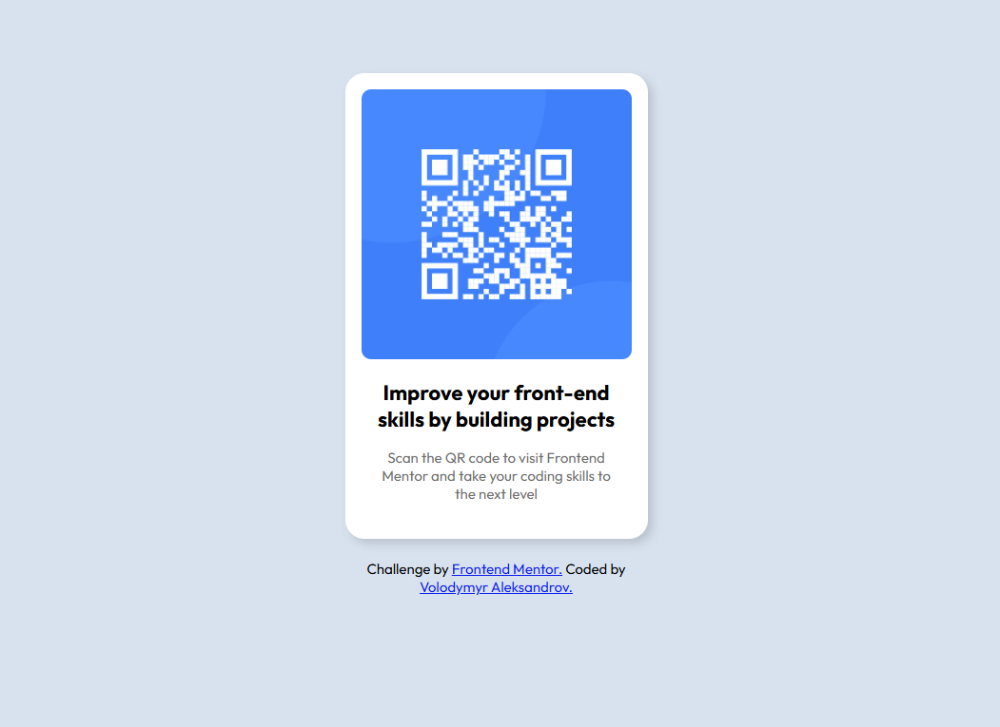

# Frontend Mentor - QR code component solution

This is a solution to the [QR code component challenge on Frontend Mentor](https://www.frontendmentor.io/challenges/qr-code-component-iux_sIO_H). Frontend Mentor challenges help you improve your coding skills by building realistic projects. 

## Table of contents

- [Overview](#overview)
  - [Screenshot](#screenshot)
  - [Links](#links)
- [My process](#my-process)
  - [Built with](#built-with)
  - [What I learned](#what-i-learned)
  - [Continued development](#continued-development)
  - [Useful resources](#useful-resources)
  - [AI Collaboration](#ai-collaboration)
- [Author](#author)
- [Acknowledgments](#acknowledgments)

## Overview

### Screenshot



### Links

- Solution URL: [Add solution URL here](https://github.com/aleksandrovvolodymyr97-oss/pj2)
- Live Site URL: [Add live site URL here](https://aleksandrovvolodymyr97-oss.github.io/pj2/)

## My process

### Built with

- Semantic HTML5 markup
- CSS custom properties
- Flexbox
- [Visual Studio Code](https://code.visualstudio.com/)

### What I learned

- HTML structure
```html
<!DOCTYPE html>
<html>
  <head>
    <title></title>
  </head>
  <body>
    <div>
    </div>
  </body>
</html>
```
- CSS structure
```css
body {
  position: relative;
  display: flex;
  font-family: Outfit, Arial;
  background-color: hsl(212, 45%, 89%);
}
.qr {
  position: relative;
  background-color: white;
  box-shadow: 5px 5px 10px rgba(0, 0, 0, 0.15);
}
```

### Continued development

In future projects I wants to learn JavaScript and show how to use this.

### Useful resources

- [HTML & CSS Full Course - Beginner to Pro](https://youtu.be/G3e-cpL7ofc) - This helped me to learn and make HTML & CSS. I really like this and recommend to everyone who want to learn how to create your own web site.

### AI Collaboration

- I used ChatGPT
- If I can't to find any solutions in Google I used AI for give me some recommended ideas for solving
- It's worked well if you write a good prompts and give a part of your code to AI

## Author

- Website - [Volodymyr Aleksandrov](https://github.com/aleksandrovvolodymyr97-oss)
- Frontend Mentor - [@aleksandrovvolodymyr97-oss](https://www.frontendmentor.io/profile/aleksandrovvolodymyr97-oss)
